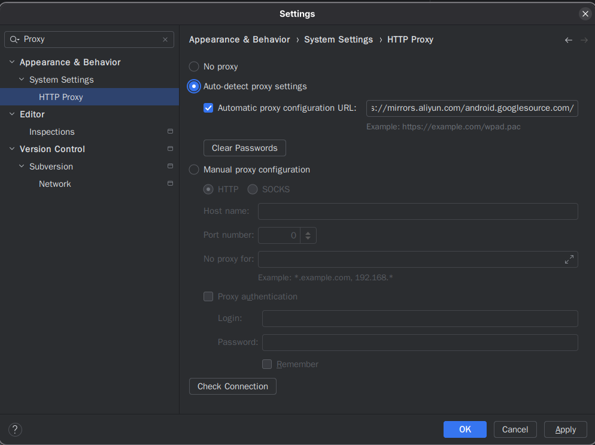

# Android开发环境安装与项目配置

开发环境使用Android Studio,然后在Android Studio中下载Android SDK即可
项目配置就是替换一下一些镜像源,替换为国内的就行

## Android开发环境配置

1. [官网](https://developer.android.google.cn)下载Android Studio.
2. 解压下载的tar.gz文件,进入其中bin文件夹执行studio文件.
3. 进入Setting->Appearance & Behavior->System Settings->Http Proxy.
4. 填入```https://mirrors.aliyun.com/android.googlesource.com/```
5. 关掉程序,重新执行studio,下载Android SDK和Android Platform



## 项目配置

新建项目后修改settings.gradle.kts,只修改新增的地方就行

```kotlin
pluginManagement {
    repositories {
        maven {
            url = uri("https://maven.aliyun.com/repository/google")       //新增google 插件的maven库
            content {                                                     //精准只搜索这些插件包
                includeGroupByRegex("com\\.android.*")
                includeGroupByRegex("com\\.google.*")
                includeGroupByRegex("androidx.*")
            }
        } 
        maven { url = uri("https://maven.aliyun.com/repository/public") } //新增maven central和jcenter 插件的maven库
        maven { url = uri("https://maven.aliyun.com/repository/gradle-plugin") } //新增gradle-plugin 插件的maven库
        google {
            content {
                includeGroupByRegex("com\\.android.*")
                includeGroupByRegex("com\\.google.*")
                includeGroupByRegex("androidx.*")
            }
        }
        mavenCentral()
        gradlePluginPortal()
    }
}
dependencyResolutionManagement {
    repositoriesMode.set(RepositoriesMode.FAIL_ON_PROJECT_REPOS)
    repositories {
        maven { url = uri("https://maven.aliyun.com/repository/google") } //新增google 依赖的maven库
        maven { url = uri("https://maven.aliyun.com/repository/public") } //新增maven central和jcenter 依赖的maven库
        google()
        mavenCentral()
    }
}
```

修改gradle文件夹里面的gradle-wrapper.properties,修改distributionUrl为```https\://mirrors.aliyun.com/macports/distfiles/gradle/gradle-X.X.X-all.zip```
